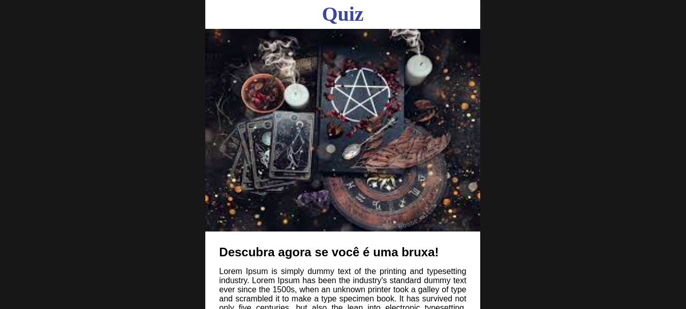
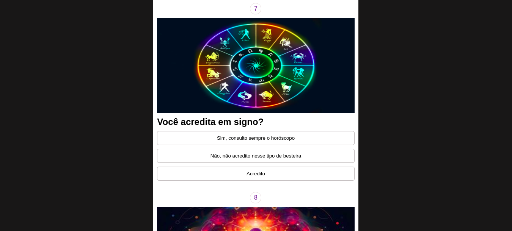
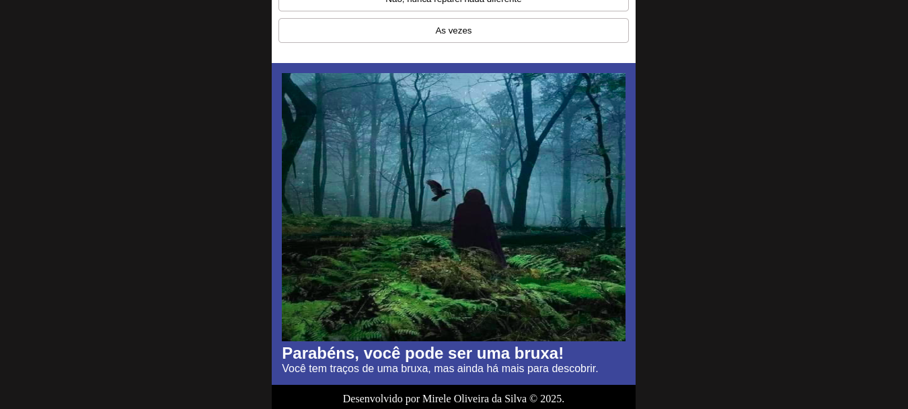

  <h1>
Quiz sobre bruxas
</h1>
  

     
    
    
    
      
 

   
Este projeto lúdico consiste em um quiz sobre bruxas, desenvolvido com HTML, CSS e JavaScript, responsivo em todos os formatos. Ao responder às perguntas, ele informa se você é uma bruxa, poderia ser uma bruxa ou não é uma bruxa. Vale lembrar que essas perguntas e resultados são fictícios, com o único objetivo de entretenimento. Ademais, foi implementado a propriedade scroll do CSS para rolar entre as perguntas.

  
Desenvolvido por <a target="_blank" rel="external" href="https://github.com/MegMinnie/"><strong>Mirele Oliveira da Silva</strong></a>

 

  
  ## Como Acessar a Aplicação

Acesse a aplicação por meio do link: <a href="https://megminnie.github.io/QUIZ/
"_blank">clique aqui</a>

## *Screenshots*
  
  
  

  

